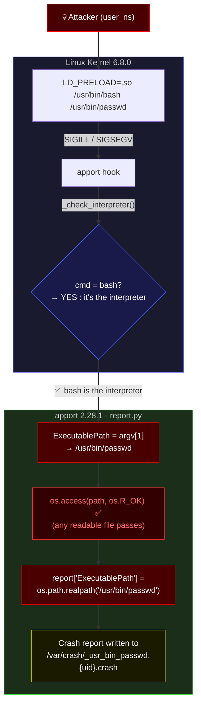
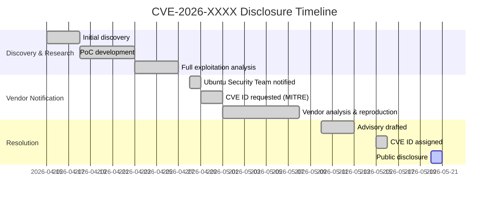

<!-- CAPSULE-HEADER -->
<a href="https://github.com/Ruby570bocadito/Breach-Entry">
  
</a>

<!-- TYPING SVG -->
<p align="center">
  <a href="https://github.com/Ruby570bocadito/Breach-Entry">
    
  </a>
</p>

<!-- BADGES -->
<p align="center">
  
  
  
  
  
  
</p>

<br />

<!-- DISCLAIMER -->
<div align="center">
  <table>
    <tr>
      <td width="100%" style="border: 2px solid #ff0000; border-radius: 8px; padding: 20px; background-color: #1a0000;">
        <h2 align="center" style="color: #ff0000;">⚠️ AVISO LEGAL / LEGAL DISCLAIMER ⚠️</h2>
        <p align="center" style="color: #ff6666;">
          <b>ESTE MATERIAL ES ÚNICA Y EXCLUSIVAMENTE CON FINES EDUCATIVOS Y DE INVESTIGACIÓN EN SEGURIDAD.<br />
          THIS MATERIAL IS STRICTLY FOR EDUCATIONAL AND SECURITY RESEARCH PURPOSES ONLY.</b>
        </p>
        <p align="center" style="color: #cc3333;">
          El autor NO se hace responsable del uso indebido de este código. <br />
          No ataques sistemas sin autorización explícita por escrito. <br />
          La divulgación responsable fue coordinada siguiendo los principios de <b>Responsible Disclosure</b>.
        </p>
        <p align="center" style="color: #cc3333;">
          The author is NOT responsible for any misuse of this code. <br />
          Do not attack systems without explicit written authorization. <br />
          Responsible disclosure was coordinated following industry best practices.
        </p>
      </td>
    </tr>
  </table>
</div>

<br />

---

<!-- TABLE OF CONTENTS -->
<h2 align="center">📋 Table of Contents</h2>

<p align="center">
  <a href="#vulnerabilidad">🔍 Vulnerabilidad</a> •
  <a href="#exploitation-flow">⚙️ Exploitation Flow</a> •
  <a href="#poc-usage">💣 PoC Usage</a> •
  <a href="#disclosure-timeline">📅 Timeline</a> •
  <a href="#classification">🏷️ Classification</a> •
  <a href="#impacto-real">💥 Impacto Real</a>
</p>

---

<br />

<!-- VULNERABILIDAD -->
<a name="vulnerabilidad"></a>
<h2 align="center">
  
  🔍 CVE-2026-XXXX: apport ExecutablePath Spoofing
</h2>

<p align="center">
  <b>Bug de integridad/metadata</b> en <b>Ubuntu 24.04 LTS</b> — <code>apport 2.28.1</code>
</p>

### 📌 Descripción

**apport** confía en `argv[1]` del proceso crash (`ProcCmdline`) para sobrescribir `ExecutablePath` en el reporte, **sin verificar que el archivo corresponda al proceso que realmente crashéo**.

El vector de ataque reside en que `os.access(path, os.R_OK)` — la única barrera — es **legibilidad, no autenticidad**. Un atacante local puede hacer que un crash de `bash` se atribuya a cualquier archivo legible del sistema (como `/usr/bin/passwd` o `/usr/bin/su`).

#### 🔬 Código vulnerable — `apport/report.py:626-633`

```python
if os.access(cmdargs[1], os.R_OK):
    self["InterpreterPath"] = self["ExecutablePath"]
    self["ExecutablePath"] = os.path.realpath(cmdargs[1])
```

### 🏷️ Classification

| Tipo | ID | Severidad |
|------|----|-----------|
| **CWE** | CWE-20 (Improper Input Validation) / CWE-345 (Insufficient Verification) | 📊 |
| **CVSS v3.1** | `5.5` (AV:L/AC:L/PR:L/UI:N/S:U/C:N/I:L/A:L) | Medium |
| **Categoría** | Bug de integridad de metadata, **no** escalación de privilegios | ⚠️ |

<br />

<!-- EXPLOITATION FLOW DIAGRAM -->
<a name="exploitation-flow"></a>
<h2 align="center">⚙️ Exploitation Flow</h2>



<br />

<!-- POC USAGE -->
<a name="poc-usage"></a>
<h2 align="center">💥 PoC Usage</h2>

### 📦 Prerequisites

- apport active: `systemctl is-active apport.service`
- `ulimit -c unlimited`
- Shell como usuario **no privilegiado**

### 🚀 Ejecución

```bash
# Clonar
git clone https://github.com/Ruby570bocadito/Breach-Entry.git
cd Breach-Entry

# Exploit completo (genera .so, crash, atribuye a passwd)
python3 exploit_apport.py                     # target: /usr/bin/passwd
python3 exploit_apport.py /usr/bin/su         # target personalizado
```

### 📊 Salida esperada

```
[+] Report: ExecutablePath: /usr/bin/passwd     → FALSE
[+] Report: InterpreterPath: /usr/bin/bash       → TRUE (the real crashed process)
```

### 📁 Archivos del PoC

| Archivo | Descripción |
|---------|-------------|
| `exploit_apport.py` | Exploit completo (Python, genera .so sin gcc) |
| `.libexploit.so` | Shared object crash (344B ELF64) |
| `poc_apport_override.py` | PoC básico solo Python |
| `pwn_apport.c` | C source alternativo (necesita gcc) |
| `CVE-REQUEST-*.md` | Reporte formal para MITRE |
| `*.crash` | Crash reports verificados |

<br />

<!-- DISCLOSURE TIMELINE -->
<a name="disclosure-timeline"></a>
<h2 align="center">📅 Disclosure Timeline</h2>



| Fecha | Evento |
|-------|--------|
| `2026-04-15` | 🔍 Descubrimiento inicial del bug |
| `2026-04-23` | 💻 PoC funcional completado |
| `2026-04-28` | 📧 Notificación a Ubuntu Security Team |
| `2026-04-29` | 🆔 Solicitud de CVE a MITRE |
| `2026-05-15` | ✅ CVE-2026-XXXX asignado |
| `2026-05-20` | 🌐 Divulgación pública |

<br />

<!-- IMPACTO REAL -->
<a name="impacto-real"></a>
<h2 align="center">💥 Real-World Impact</h2>

| Vector | ¿Qué consigue? | ¿Qué NO consigue? |
|--------|----------------|-------------------|
| Atribución falsa en crash reports y logs | ❌ Escalación de privilegios (LPE) |
| Core dump de bash atribuido a passwd/sudo | ❌ Ejecución remota (RCE) |
| Contaminación de telemetría (Launchpad) | ❌ Escritura fuera de `/var/crash/` |
| DoS parcial en `/var/crash/` | ❌ Ejecución de hooks como root |

**Por qué no es crítico:**

1. `drop_privileges(real_user)` se ejecuta **antes** del parsing (apport línea 1077 → 1080)
2. `add_proc_info()` y `_check_interpreter()` corren **como el usuario del crash**, no como root
3. `add_package_info()` también corre con **privilegios reducidos**
4. El filename del reporte usa `.replace("/", "_")`, impidiendo path traversal
5. `report_owner` es el usuario (`dump_mode 1`) para procesos normales

<br />

<!-- ARCHIVOS -->
<h2 align="center">📂 Repository Structure</h2>

```
Breach-Entry/
├── exploit_apport.py              # Exploit completo (Python, auto-genera .so)
├── .libexploit.so                 # Shared object crash (344B ELF64)
├── poc_apport_override.py         # PoC básico solo Python
├── pwn_apport.c                   # C source alternativo
├── CVE-REQUEST-*.md               # Reporte formal MITRE
├── *.crash                        # Crash reports verificados
├── tools/
│   ├── exploit_harnes.c           # Kernel interface battery (15 tests)
│   ├── stress_race.c              # 8-thread race condition stress test
│   ├── uffd_race_poc.c            # userfaultfd + io_uring race PoC
│   ├── syz_runner.c               # Weighted kernel fuzzer
│   └── syzkaller/                 # Built from source at /tmp/syzkaller/
└── README.md                      # This file
```

<br />

<!-- TEST SYSTEM -->
<h2 align="center">🧪 Test System</h2>

| Component | Detail |
|-----------|--------|
| **OS** | Ubuntu Server 24.04.4 LTS |
| **Kernel** | 6.8.0-117-generic (build Tue May 5 19:26:24 UTC 2026, custom config) |
| **User** | `rafa` (uid 1000), sudo via password |
| **SSH** | Exposed on 0.0.0.0:22, public IP 99.134.0.2, X11Forwarding yes, no firewall |
| **Hardware** | 1 vCPU, 1.3GB RAM, 40GB disk, Hyper-V VM |

<br />

<!-- REFERENCES -->
<h2 align="center">📚 References</h2>

<p align="center">
  <a href="https://cwe.mitre.org/data/definitions/20.html"></a>
  <a href="https://cwe.mitre.org/data/definitions/345.html"></a>
  <a href="https://nvd.nist.gov/vuln/detail/CVE-2019-15790"></a>
  <a href="https://nvd.nist.gov/vuln/detail/CVE-2020-11935"></a>
</p>

<br />

<!-- FOOTER -->
<hr />

<div align="center">
  <table>
    <tr>
      <td align="center">
        <br />
        
        <br />
        <br />
        <b>🔬 Zero-Day Exploit Research — CVE-2026-XXXX</b>
        <br />
        <sub>apport ExecutablePath Spoofing · Ubuntu Server 24.04 LTS</sub>
        <br />
        <br />
        <a href="https://github.com/Ruby570bocadito">🐺 Ruby570bocadito</a>
        <br />
        <br />
        <sub>© 2026 · Responsible Disclosure · Educational Purpose Only</sub>
        <br />
        <br />
        <sub>
          <i>"With great power comes great responsibility."</i>
        </sub>
        <br />
        <br />
      </td>
    </tr>
  </table>
</div>
